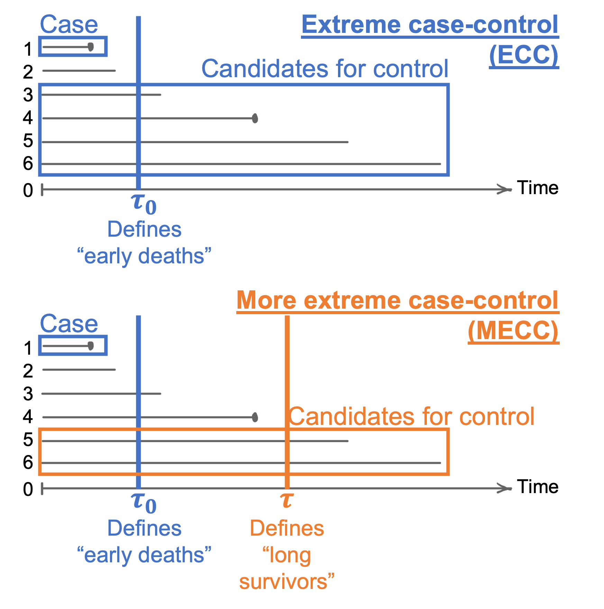

SamplingDesignTools: Tools for Dealing with Complex Sampling Designs
================
Created on 2020-05-29. Updated on 2022-06-11

-   <a href="#0-getting-started" id="toc-0-getting-started">0 Getting
    Started</a>
    -   <a href="#installation" id="toc-installation">Installation</a>
    -   <a href="#example-datasets" id="toc-example-datasets">Example
        Datasets</a>
        -   <a href="#cohort_1" id="toc-cohort_1"><code>cohort_1</code></a>
        -   <a href="#cohort_2" id="toc-cohort_2"><code>cohort_2</code></a>
-   <a href="#1-drawing-counter-matched-sample"
    id="toc-1-drawing-counter-matched-sample">1 Drawing counter-matched
    sample</a>
    -   <a href="#counter-match-on-binary-surrogate"
        id="toc-counter-match-on-binary-surrogate">Counter-match on binary
        surrogate</a>
    -   <a href="#counter-match-on-categorical-surrogate"
        id="toc-counter-match-on-categorical-surrogate">Counter-match on
        categorical surrogate</a>
    -   <a href="#compare-results" id="toc-compare-results">Compare results</a>
-   <a href="#2-compute-km-type-weights-for-ncc-sample"
    id="toc-2-compute-km-type-weights-for-ncc-sample">2 Compute KM-type
    weights for NCC sample</a>
    -   <a href="#12-ncc-matched-on-age-and-gender"
        id="toc-12-ncc-matched-on-age-and-gender">1:2 NCC matched on age and
        gender</a>
    -   <a href="#compare-results-1" id="toc-compare-results-1">Compare
        results</a>
-   <a href="#3-compute-weights-for-ncc-without-full-cohort"
    id="toc-3-compute-weights-for-ncc-without-full-cohort">3 Compute weights
    for NCC without full cohort</a>
-   <a href="#4-weighted-analysis-of-more-extreme-case-control-samples"
    id="toc-4-weighted-analysis-of-more-extreme-case-control-samples">4
    Weighted analysis of (more) extreme case-control samples</a>

# 0 Getting Started

## Installation

Install the SamplingDesignTools package from GitHub (package devtools
needed):

``` r
devtools::install_github("nyilin/SamplingDesignTools")
```

Load packages used:

``` r
library(SamplingDesignTools)
library(survival)
library(dplyr)
## 
## Attaching package: 'dplyr'
## The following objects are masked from 'package:stats':
## 
##     filter, lag
## The following objects are masked from 'package:base':
## 
##     intersect, setdiff, setequal, union
library(Epi) # To draw (non-counter-matched) nested case-control sample
```

## Example Datasets

This package uses two simulated cohort data (`cohort_1` and
`cohort_2`)for illustrative purpose.

### `cohort_1`

Dataset `cohort_1` consists of 10,000 subjects with age simulated from
"))
and gender simulated with
").
The survival outcome simulated from the following true hazard:

\} = \log \{h_0\} + \log(1.1) \text{Age} + \log(2) \text{Gender}.")

Time
()
is measured in years and censored at 25 years. Censoring is indicated by
.

``` r
data("cohort_1")
dim(cohort_1)
## [1] 10000     5
table(cohort_1$y)
## 
##    0    1 
## 9418  582
kable(head(cohort_1))
```

|  id |   y |        t | age | gender |
|----:|----:|---------:|----:|-------:|
|   1 |   0 | 25.00000 |  47 |      1 |
|   2 |   0 | 10.65152 |  58 |      0 |
|   3 |   0 | 25.00000 |  46 |      0 |
|   4 |   0 | 15.84131 |  52 |      0 |
|   5 |   0 | 22.57659 |  49 |      0 |
|   6 |   0 | 25.00000 |  63 |      0 |

``` r
m_cox_cohort_1 <- coxph(Surv(t, y) ~ age + gender, data = cohort_1)
summary(m_cox_cohort_1)
## Call:
## coxph(formula = Surv(t, y) ~ age + gender, data = cohort_1)
## 
##   n= 10000, number of events= 582 
## 
##            coef exp(coef) se(coef)      z Pr(>|z|)    
## age    0.100340  1.105546 0.004213 23.820   <2e-16 ***
## gender 0.781068  2.183804 0.087990  8.877   <2e-16 ***
## ---
## Signif. codes:  0 '***' 0.001 '**' 0.01 '*' 0.05 '.' 0.1 ' ' 1
## 
##        exp(coef) exp(-coef) lower .95 upper .95
## age        1.106     0.9045     1.096     1.115
## gender     2.184     0.4579     1.838     2.595
## 
## Concordance= 0.784  (se = 0.009 )
## Likelihood ratio test= 643.4  on 2 df,   p=<2e-16
## Wald test            = 643.8  on 2 df,   p=<2e-16
## Score (logrank) test = 642.4  on 2 df,   p=<2e-16
```

### `cohort_2`

Dataset `cohort_2` consists of 100,000 subjects, with survival outcome
simulated from the following true hazard:

\} = \log \{h_0\} + \log(1.5)x + \log(4)z + \log(2)xz + 
\log(1.01) \text{Gender} + \log(1.01) \text{Age}.")

Time
()
is measured in years and censored at 25 years. Censoring is indicated by
.
Age is also recorded in 6 categories: \<35, 36-45, 46-55, 56-65, 66-75
and \>75.

``` r
data("cohort_2")
dim(cohort_2)
## [1] 100000      8
table(cohort_2$y)
## 
##     0     1 
## 97227  2773
kable(head(cohort_2))
```

|  id |   y |         t |   x | age | age_cat    | gender |   z |
|----:|----:|----------:|----:|----:|:-----------|-------:|----:|
|   1 |   0 | 25.000000 |   1 |  -2 | (45,55\]   |      0 |   0 |
|   2 |   0 | 19.819801 |   1 |  -4 | (45,55\]   |      1 |   0 |
|   3 |   0 | 25.000000 |   1 |  -5 | (45,55\]   |      0 |   0 |
|   4 |   0 | 12.414616 |   1 |  20 | (75, Inf\] |      1 |   0 |
|   5 |   0 | 25.000000 |   1 |  -2 | (45,55\]   |      0 |   1 |
|   6 |   0 |  1.019023 |   0 | -15 | (35,45\]   |      1 |   0 |

``` r
m_cox_cohort_2 <- coxph(Surv(t, y) ~ x * z + age + gender, data = cohort_2)
summary(m_cox_cohort_2)
## Call:
## coxph(formula = Surv(t, y) ~ x * z + age + gender, data = cohort_2)
## 
##   n= 100000, number of events= 2773 
## 
##             coef exp(coef)  se(coef)      z Pr(>|z|)    
## x       0.382501  1.465946  0.109906  3.480 0.000501 ***
## z       1.495078  4.459686  0.126331 11.835  < 2e-16 ***
## age     0.007139  1.007165  0.001898  3.762 0.000169 ***
## gender -0.086074  0.917526  0.038010 -2.265 0.023542 *  
## x:z     0.640698  1.897805  0.135081  4.743 2.11e-06 ***
## ---
## Signif. codes:  0 '***' 0.001 '**' 0.01 '*' 0.05 '.' 0.1 ' ' 1
## 
##        exp(coef) exp(-coef) lower .95 upper .95
## x         1.4659     0.6822    1.1819    1.8183
## z         4.4597     0.2242    3.4815    5.7127
## age       1.0072     0.9929    1.0034    1.0109
## gender    0.9175     1.0899    0.8517    0.9885
## x:z       1.8978     0.5269    1.4564    2.4730
## 
## Concordance= 0.762  (se = 0.005 )
## Likelihood ratio test= 2907  on 5 df,   p=<2e-16
## Wald test            = 2435  on 5 df,   p=<2e-16
## Score (logrank) test = 3528  on 5 df,   p=<2e-16
```

# 1 Drawing counter-matched sample

This section describes how to use `draw_ncc_cm()` to draw
counter-matched nested case-control (NCC) samples, and subsequently how
to analyze the sample using a weighted conditional likelihood approach.

Examples in this section use `cohort_1` as the underlying cohort, and
considers the continuous variable age as the continuous exposure of
interest, just for illustrative purpose.

Reference:

-   Langholz B.
    [Counter‐Matching](https://onlinelibrary.wiley.com/doi/abs/10.1002/9781118445112.stat05225).
    Wiley StatsRef: Statistics Reference Online. 2014 Apr 14.

## Counter-match on binary surrogate

This analysis uses dichotomous age (at 50 years) as a surrogate to the
actual exposure to draw a counter-matched NCC sample with 1 control per
case.

``` r
cohort_1$age_bin <- as.numeric(cohort_1$age < 50)
table(cohort_1$age_bin)
## 
##    0    1 
## 7181 2819
ncc_cm_bin <- draw_ncc_cm(cohort = cohort_1, y_name = "y", t_name = "t", 
                          match_var_name = "age_bin", 
                          include_var_name = c("age", "gender"), ml = 1)
head(ncc_cm_bin)
##      set row_id         t n_at_risk n_sampled weight y age_bin age gender
## 11    11     11  6.952504      4866         1   4866 1       0  60      0
## 6682  11   6682  6.952504      2002         1   2002 0       1  41      1
## 29    29     29 11.157250      3802         1   3802 1       0  64      0
## 6543  29   6543 11.157250      1594         1   1594 0       1  40      0
## 58    58     58 24.578458      1860         1   1860 1       0  63      0
## 1434  58   1434 24.578458       810         1    810 0       1  43      1
table(ncc_cm_bin$age_bin, ncc_cm_bin$y)
##    
##       0   1
##   0  32 550
##   1 550  32
m_clogit_bin <- clogit(y ~ age + gender + strata(set) + offset(log(weight)), 
                       data = ncc_cm_bin)
```

## Counter-match on categorical surrogate

This analysis divided age into 4 categories (at 40, 50 and 60 years) to
create a categorical surrogate to the exposure, and subsequently drew a
counter-matched NCC sample with one control per age category, i.e., in
total 3 controls per case.

``` r
cohort_1$age_quart <- cut(cohort_1$age, breaks = c(-Inf, 40, 50, 60, Inf), 
                          labels = 1:4, include.lowest = TRUE)
table(cohort_1$age_quart)
## 
##    1    2    3    4 
##  712 2453 3908 2927
ncc_cm_quart <- draw_ncc_cm(cohort = cohort_1, y_name = "y", t_name = "t", 
                            match_var_name = "age_quart", 
                            include_var_name = c("age", "gender"), ml = 1)
head(ncc_cm_quart, 20)
##      set row_id         t n_at_risk n_sampled weight y age_quart age gender
## 5123  11   5123  6.952504       512         1    512 0         1  39      1
## 1050  11   1050  6.952504      1756         1   1756 0         2  42      0
## 11    11     11  6.952504      2672         1   2672 1         3  60      0
## 9857  11   9857  6.952504      1928         1   1928 0         4  63      0
## 4445  29   4445 11.157250       413         1    413 0         1  28      1
## 3770  29   3770 11.157250      1392         1   1392 0         2  42      1
## 4913  29   4913 11.157250      2116         1   2116 0         3  57      0
## 29    29     29 11.157250      1475         1   1475 1         4  64      0
## 9234  58   9234 24.578458       211         1    211 0         1  36      1
## 7715  58   7715 24.578458       704         1    704 0         2  50      1
## 3727  58   3727 24.578458      1066         1   1066 0         3  51      0
## 58    58     58 24.578458       689         1    689 1         4  63      0
## 7369  67   7369  1.434794       665         1    665 0         1  25      1
## 9614  67   9614  1.434794      2300         1   2300 0         2  43      1
## 1404  67   1404  1.434794      3607         1   3607 0         3  60      0
## 67    67     67  1.434794      2683         1   2683 1         4  65      1
## 170   89    170 19.254871       269         1    269 0         1  39      1
## 3947  89   3947 19.254871       933         1    933 0         2  50      0
## 8190  89   8190 19.254871      1395         1   1395 0         3  53      0
## 89    89     89 19.254871       922         1    922 1         4  64      1
table(ncc_cm_quart$age_quart)
## 
##   1   2   3   4 
## 582 582 582 582
m_clogit_quart <- clogit(y ~ age + gender + strata(set) + offset(log(weight)), 
                         data = ncc_cm_quart)
```

## Compare results

``` r
results_1 <- rbind(summary(m_cox_cohort_1)$coef, 
                   summary(m_clogit_bin)$coef, 
                   summary(m_clogit_quart)$coef)
rownames(results_1) <- NULL
kable(data.frame(
  Data = c("Full cohort", "", 
           "NCC-CM, 1 control per case", "", 
           "NCC-CM, 3 controls per case", ""), 
  Variable = rep(c("Age", "Male"), 3), 
  `True HR` = rep(c(1.1, 2), 3),
  `Estimated HR` = results_1[, "exp(coef)"], 
  `SE of log(HR)` = results_1[, "se(coef)"], 
  `p-value` = results_1[, "Pr(>|z|)"], check.names = FALSE
), digits = c(0, 0, 1, 2, 3, 3))
```

| Data                        | Variable | True HR | Estimated HR | SE of log(HR) | p-value |
|:----------------------------|:---------|--------:|-------------:|--------------:|--------:|
| Full cohort                 | Age      |     1.1 |         1.11 |         0.004 |       0 |
|                             | Male     |     2.0 |         2.18 |         0.088 |       0 |
| NCC-CM, 1 control per case  | Age      |     1.1 |         1.13 |         0.013 |       0 |
|                             | Male     |     2.0 |         3.21 |         0.303 |       0 |
| NCC-CM, 3 controls per case | Age      |     1.1 |         1.11 |         0.006 |       0 |
|                             | Male     |     2.0 |         2.56 |         0.133 |       0 |

# 2 Compute KM-type weights for NCC sample

This section describes how to use `compute_km_weights()` to draw NCC
samples and compute Kaplan-Meier type (KM-type) weights, and
subsequently how to analyze the sample using a weighted Cox approach.

Examples in this section use `cohort_2` as the underlying cohort.

References:

-   Samuelsen SO. [A psudolikelihood approach to analysis of nested
    case-control
    studies](https://academic.oup.com/biomet/article-abstract/84/2/379/233968?redirectedFrom=fulltext).
    Biometrika. 1997 Jun 1;84(2):379-94.
-   Borgan Ø, Samuelsen SO. [A review of cohort sampling designs for
    Cox’s regression model: potentials in
    epidemiology](https://www.ntnu.no/ojs/index.php/norepid/article/view/292).
    Norsk Epidemiologi. 2003;13(2).

## 1:2 NCC matched on age and gender

Consider an idealistic scenario, where the full cohort is available to
calculate the KM-type weights. A NCC sample was draw (using
`Epi::ccwc()`) with 2 controls per case, matched on age group and
gender.

``` r
n_per_case <- 2
ncc_2 <- ccwc(exit = t, fail = y, controls = n_per_case, 
              match = list(age_cat, gender), include = list(x, age, z), 
              data = cohort_2, silent = TRUE)
names(ncc_2)[-(1:4)] <- c("age_cat", "gender", "x", "age", "z")
head(ncc_2, 12)
##    Set   Map       Time Fail age_cat gender x age z
## 1    1    36  0.2016047    1 (35,45]      1 1 -16 0
## 2    1 78786  0.2016047    0 (35,45]      1 0 -14 0
## 3    1 32614  0.2016047    0 (35,45]      1 1 -11 1
## 4    2   888  4.9218685    1 (35,45]      1 1 -20 1
## 5    2 35056  4.9218685    0 (35,45]      1 1 -14 0
## 6    2 30795  4.9218685    0 (35,45]      1 1 -13 0
## 7    3  1037 21.4651890    1 (35,45]      1 1 -15 1
## 8    3 76713 21.4651890    0 (35,45]      1 1 -12 0
## 9    3 22222 21.4651890    0 (35,45]      1 1 -14 1
## 10   4  1200 15.7674384    1 (35,45]      1 1 -15 1
## 11   4 73327 15.7674384    0 (35,45]      1 1 -13 0
## 12   4  6270 15.7674384    0 (35,45]      1 0 -18 0
# Create the sampling and status indicator
sample_stat <- numeric(nrow(cohort_2))
sample_stat[unique(ncc_2$Map[ncc_2$Fail == 0])] <- 1
sample_stat[ncc_2$Map[ncc_2$Fail == 1]] <- 2
table(sample_stat)
## sample_stat
##     0     1     2 
## 92010  5217  2773
ncc_2_nodup <- compute_km_weights(cohort = cohort_2, t_name = "t", y_name = "y",
                                  sample_stat = sample_stat, 
                                  match_var_names = c("age_cat", "gender"), 
                                  n_per_case = n_per_case)
## Start time is 0 for all subjects. Event/censoring time is given by variable t.
## Joining, by = c("age_cat", "gender")
## Joining, by = "strata"
head(ncc_2_nodup)
##    id y          t x age age_cat gender z    km_prob km_weight
## 18 18 0 23.0020275 1 -11 (35,45]      0 1 0.07969598  12.54769
## 36 36 1  0.2016047 1 -16 (35,45]      1 0 1.00000000   1.00000
## 61 61 1 14.8098399 1   7 (55,65]      0 0 1.00000000   1.00000
## 72 72 1  4.1087132 1  -1 (45,55]      0 1 1.00000000   1.00000
## 76 76 1 20.1285244 1  15 (65,75]      0 1 1.00000000   1.00000
## 84 84 1  5.9032539 1  -9 (45,55]      1 1 1.00000000   1.00000
summary(ncc_2_nodup$km_weight)
##    Min. 1st Qu.  Median    Mean 3rd Qu.    Max. 
##    1.00    1.00   10.64   12.39   13.42  652.51
m_cox_ncc_2 <- coxph(Surv(t, y) ~ x * z + gender + age, data = ncc_2_nodup,
                     weights = km_weight, robust = TRUE)
m_clogit_ncc_2 <- clogit(Fail ~ x * z + strata(Set), data = ncc_2)
```

By breaking the matching in the NCC and performing a weighted analysis,
users are also able to estimate the absolute risk that is not available
from NCC in conventional conditional approach. This is not illustrated
here but have been described in following papers:

-   Salim A, Delcoigne B, Villaflores K, Koh WP, Yuan JM, van Dam RM,
    Reilly M. [Comparisons of risk prediction methods using nested
    case‐control data](https://pubmed.ncbi.nlm.nih.gov/27734520/).
    Statistics in medicine. 2017 Feb 10;36(3):455-65.
-   Delcoigne B, Colzani E, Prochazka M, Gagliardi G, Hall P,
    Abrahamowicz M, Czene K, Reilly M. [Breaking the matching in nested
    case–control data offered several advantages for risk
    estimation](https://pubmed.ncbi.nlm.nih.gov/27923734/). Journal of
    clinical epidemiology. 2017 Feb 1;82:79-86.

## Compare results

Compared to conventional conditional logistic regression analysis of
matched sets, weighted Cox analysis of sampled subjects produces smaller
SE, and provides estimates for matching factors.

``` r
results_2 <- rbind(summary(m_cox_cohort_2)$coef, 
                   summary(m_clogit_ncc_2)$coef, 
                   summary(m_cox_ncc_2)$coef[, -3])
results_2 <- data.frame(Variable = rownames(results_2), results_2, 
                        check.names = FALSE)
rownames(results_2) <- NULL
kable(data.frame(
  Data = c("Full cohort", rep("", 4), 
           "NCC (clogit)", rep("", 2), 
           "NCC (weighted Cox)", rep("", 4)), 
  Variable = results_2$Variable, 
  `True HR` = c(c(1.5, 4, 1.01, 1.01, 2), 
                c(1.5, 4, 2), c(1.5, 4, 1.01, 1.01, 2)),
  `Estimated HR` = results_2[, "exp(coef)"], 
  `SE of log(HR)` = results_2[, "se(coef)"], 
  `p-value` = results_2[, "Pr(>|z|)"], check.names = FALSE
), digits = c(0, 0, 2, 2, 3, 3))
```

| Data               | Variable | True HR | Estimated HR | SE of log(HR) | p-value |
|:-------------------|:---------|--------:|-------------:|--------------:|--------:|
| Full cohort        | x        |    1.50 |         1.47 |         0.110 |   0.001 |
|                    | z        |    4.00 |         4.46 |         0.126 |   0.000 |
|                    | age      |    1.01 |         1.01 |         0.002 |   0.000 |
|                    | gender   |    1.01 |         0.92 |         0.038 |   0.024 |
|                    | x:z      |    2.00 |         1.90 |         0.135 |   0.000 |
| NCC (clogit)       | x        |    1.50 |         1.45 |         0.122 |   0.002 |
|                    | z        |    4.00 |         4.25 |         0.151 |   0.000 |
|                    | x:z      |    2.00 |         1.96 |         0.163 |   0.000 |
| NCC (weighted Cox) | x        |    1.50 |         1.47 |         0.117 |   0.001 |
|                    | z        |    4.00 |         4.25 |         0.141 |   0.000 |
|                    | gender   |    1.01 |         0.95 |         0.054 |   0.333 |
|                    | age      |    1.01 |         1.01 |         0.003 |   0.002 |
|                    | x:z      |    2.00 |         2.02 |         0.153 |   0.000 |

# 3 Compute weights for NCC without full cohort

KM-type weights can be computed for the NCC sample as long the time of
event/censoring for each subject is available, and the number of
subjects at risk can be obtained (or approximated) elsewhere.

This section considers a more realistic scenario where the cohort is no
longer available, and subjects at risk are approximated using the number
of subjects at risk in a year.

To match NCC sample to the coarsened time frame, create a variable
`t_yr` by rounding the exact event/censoring time, `t` to the next
integer, and use this coarsened time to compute the number at risk:

``` r
ncc_2$t <- cohort_2$t[ncc_2$Map]
ncc_2$t_yr <- ceiling(ncc_2$t)
cohort_2$t_yr <- ceiling(cohort_2$t)
risk_table_coarse <- compute_risk_table(cohort = cohort_2, t_name = "t_yr", 
                                        y_name = "y", 
                                        match_var_names = c("age_cat", "gender"))
## Start time is 0 for all subjects. Event/censoring time is given by variable t_yr.
## Joining, by = c("age_cat", "gender")
## Joining, by = "strata"
head(risk_table_coarse)
##   t_event n_event n_at_risk   age_cat gender
## 1       1       3      1165 (-Inf,35]      0
## 2       3       2      1045 (-Inf,35]      0
## 3       4       2       983 (-Inf,35]      0
## 4       5       1       928 (-Inf,35]      0
## 5       8       1       806 (-Inf,35]      0
## 6       9       3       772 (-Inf,35]      0
```

In reality, number at risk at each event time may be approximated by,
e.g., size of the relevant sub-population at mid-year. In such case,
user may use the following function to generate a template for
`risk_table_coarse` to fill in:

``` r
risk_table_template <- prepare_risk_table(ncc = ncc_2, t_match_name = "t_yr", 
                                          y_name = "Fail", 
                                          match_var_names = c("gender", "age_cat"), 
                                          csv_file = NULL)
head(risk_table_template)
##   t_event gender   age_cat n_at_risk
## 1       1      0 (-Inf,35]        NA
## 2       1      0   (35,45]        NA
## 3       1      0   (45,55]        NA
## 4       1      0   (55,65]        NA
## 5       1      0   (65,75]        NA
## 6       1      0 (75, Inf]        NA
```

This template will be written to a `csv` if specified by `csv_file`,
making it easier to supply information regarding the cohort that is
required for computing the KM-type weights.

Assuming that `risk_table_coarse` is the approximated risk table
obtained from external sources, the KM-type weights for `ncc_2`
generated in the previous section can be computed using the same
`compute_km_weights()` function and subsequently analyzed using a
weighted Cox approach:

``` r
ncc_nodup2 <- compute_km_weights(ncc = ncc_2[, -1], 
                                 risk_table_manual = risk_table_coarse, 
                                 t_name = "t", y_name = "Fail", 
                                 t_match_name = "t_yr",
                                 id_name = "Map", 
                                 match_var_names = c("age_cat", "gender"), 
                                 n_per_case = 5)
## Make sure input ncc does not include ID of matched sets. Failing to do so results in Errors.
## Joining, by = c("age_cat", "gender")
## Joining, by = c(".t_event", "age_cat", "gender", "n_event")
## Joining, by = c("age_cat", "gender")
## There are 7990 unique subjects (identified by Map) in the input ncc with 8319 rows, therefore the return data only has 7990 rows.
m_cox_ncc_2_v2 <- coxph(Surv(t, Fail) ~ x * z + age + gender, 
                        data = ncc_nodup2, weights = km_weight, robust = TRUE)
```

Compare with results when the full cohort is available:

``` r
results_3 <- rbind(summary(m_cox_cohort_2)$coef, 
                   summary(m_cox_ncc_2)$coef[, -3], 
                   summary(m_cox_ncc_2_v2)$coef[, -3])
results_3 <- data.frame(Variable = rownames(results_3), results_3, 
                        check.names = FALSE)
rownames(results_3) <- NULL
kable(data.frame(
  Data = c("Full cohort", rep("", 4), 
           "NCC (weighted Cox)", rep("", 4),
           "NCC (weighted Cox, approximated weights)", rep("", 4)), 
  Variable = results_3$Variable, 
  `True HR` = rep(c(1.5, 4, 1.01, 1.01, 2), 3),
  `Estimated HR` = results_3[, "exp(coef)"], 
  `SE of log(HR)` = results_3[, "se(coef)"], 
  `p-value` = results_3[, "Pr(>|z|)"], check.names = FALSE
), digits = c(0, 0, 2, 2, 3, 3))
```

| Data                                     | Variable | True HR | Estimated HR | SE of log(HR) | p-value |
|:-----------------------------------------|:---------|--------:|-------------:|--------------:|--------:|
| Full cohort                              | x        |    1.50 |         1.47 |         0.110 |   0.001 |
|                                          | z        |    4.00 |         4.46 |         0.126 |   0.000 |
|                                          | age      |    1.01 |         1.01 |         0.002 |   0.000 |
|                                          | gender   |    1.01 |         0.92 |         0.038 |   0.024 |
|                                          | x:z      |    2.00 |         1.90 |         0.135 |   0.000 |
| NCC (weighted Cox)                       | x        |    1.50 |         1.47 |         0.117 |   0.001 |
|                                          | z        |    4.00 |         4.25 |         0.141 |   0.000 |
|                                          | gender   |    1.01 |         0.95 |         0.054 |   0.333 |
|                                          | age      |    1.01 |         1.01 |         0.003 |   0.002 |
|                                          | x:z      |    2.00 |         2.02 |         0.153 |   0.000 |
| NCC (weighted Cox, approximated weights) | x        |    1.50 |         1.42 |         0.111 |   0.002 |
|                                          | z        |    4.00 |         3.56 |         0.128 |   0.000 |
|                                          | age      |    1.01 |         1.00 |         0.002 |   0.651 |
|                                          | gender   |    1.01 |         1.03 |         0.038 |   0.446 |
|                                          | x:z      |    2.00 |         1.54 |         0.136 |   0.001 |

# 4 Weighted analysis of (more) extreme case-control samples

An extreme case-control (ECC) study is only interested in “early deaths”
design, and a more extreme case-control (MECC) further restricts
candidate controls to “longer survivors”. These two types of study
designs are described in the figure below.

<figure>

<figcaption aria-hidden="true">Extreme case-control (ECC) and more
extreme case-control (MECC). Dots denote events.</figcaption>
</figure>

This section illustrates the weighted analysis of MECC samples using the
conditional approach described in Section 2.2 of Salim et al (2014),
using the simulated cohort described in Section 1 of this paper:

-   Salim A, Ma X, Fall K, Andrén O, Reilly M. [Analysis of incidence
    and prognosis from ‘extreme’ case‐control
    designs](https://pubmed.ncbi.nlm.nih.gov/24980445/). Statistics in
    medicine. 2014 Dec 30;33(30):5388-98.

The example in this section uses `cohort_1` as the underlying cohort.
For illustrative purpose, a MECC sample was drawn by frequency-matching
2 controls to each case on gender. “Early deaths” were defined as events
before

years of follow-up, and “long survivors” were defined as subjects who
did not have the event in the first

years of follow-up. Note that an event in a MECC study (`y_mecc`) has a
different definition as an event in the original cohort study.

``` r
set.seed(1)
dat_mecc <- draw_mecc(cohort = cohort_1, tau0 = 5, tau = 15,
                      id_name = "id", t_name = "t", delta_name = "y",
                      match_var_names = "gender", n_per_case = 2)
## Joining, by = "gender"
## Joining, by = c(".t", ".strata")
## Joining, by = ".strata"
kable(head(dat_mecc))
```

|   id |   y |         t | age | gender | age_bin | age_quart | y_mecc |      surv | surv_tau | set_id_mecc |
|-----:|----:|----------:|----:|-------:|--------:|:----------|-------:|----------:|---------:|:------------|
| 8756 |   1 | 2.1351357 |  76 |      0 |       0 | 4         |      1 | 0.9943501 | 0.957786 | set_8756    |
| 8069 |   1 | 3.6774974 |  74 |      0 |       0 | 4         |      1 | 0.9898270 | 0.957786 | set_8069    |
| 5939 |   1 | 0.8364486 |  49 |      0 |       1 | 2         |      1 | 0.9979733 | 0.957786 | set_5939    |
| 1756 |   1 | 4.3993170 |  63 |      0 |       0 | 4         |      1 | 0.9878869 | 0.957786 | set_1756    |
| 7955 |   1 | 4.4904526 |  64 |      0 |       0 | 4         |      1 | 0.9876400 | 0.957786 | set_7955    |
| 1531 |   1 | 2.5664238 |  69 |      0 |       0 | 4         |      1 | 0.9918995 | 0.957786 | set_1531    |

``` r
table(y = dat_mecc$y, y_mecc = dat_mecc$y_mecc)
##    y_mecc
## y     0   1
##   0 397   0
##   1  11 204
```

As the conditional analysis of the MECC sample assumes individual
matching, the function `draw_mecc` randomly matches controls to each
case to form matched sets, indicated by the variable `set_id_mecc`. In
addition, this function provides the estimated baseline survival
probabilities (i.e.,
")
and
"))
that are needed to compute the weighted likelihood.

The weighted approach estimates the HR, where all covariates need to be
centred at the cohort average:

``` r
dat_mecc$age_c <- dat_mecc$age - mean(cohort_1$age)
# When there is only a single coefficient in, users should provide reasonable 
# lower and upper limits for the estimate:
m_mecc <- analyse_mecc_cond(
  y_name = "y_mecc", x_formula = ~ age_c, set_id_name = "set_id_mecc",
  surv = dat_mecc$surv, surv_tau = dat_mecc$surv_tau, mecc = dat_mecc,
  lower = -1, upper = 1 
)
## Warning in optimize(function(par) fn(par, ...)/con$fnscale, lower = lower, : NA/
## Inf replaced by maximum positive value

## Warning in optimize(function(par) fn(par, ...)/con$fnscale, lower = lower, : NA/
## Inf replaced by maximum positive value
round(m_mecc$coef_mat[, -1], 3)
##        est exp_est   se pval
## age_c 0.11   1.116 0.01    0
coef_cox_cohort_1 <- summary(m_cox_cohort_1)$coef
kable(data.frame(
  Data = c("Full cohort", "1:2 MECC, weighted"), 
  Variable = "Age", 
  `True HR` = 1.1,
  `Estimated HR` = c(coef_cox_cohort_1["age", "exp(coef)"], 
                     m_mecc$coef_mat["age_c", "exp_est"]), 
  `SE of log(HR)` = c(coef_cox_cohort_1["age", "se(coef)"], 
                     m_mecc$coef_mat["age_c", "se"]), 
  `p-value` = c(coef_cox_cohort_1["age", "Pr(>|z|)"], 
                     m_mecc$coef_mat["age_c", "pval"]), 
  check.names = FALSE
), digits = c(0, 0, 1, 2, 3, 3))
```

| Data               | Variable | True HR | Estimated HR | SE of log(HR) | p-value |
|:-------------------|:---------|--------:|-------------:|--------------:|--------:|
| Full cohort        | Age      |     1.1 |         1.11 |         0.004 |       0 |
| 1:2 MECC, weighted | Age      |     1.1 |         1.12 |         0.010 |       0 |
